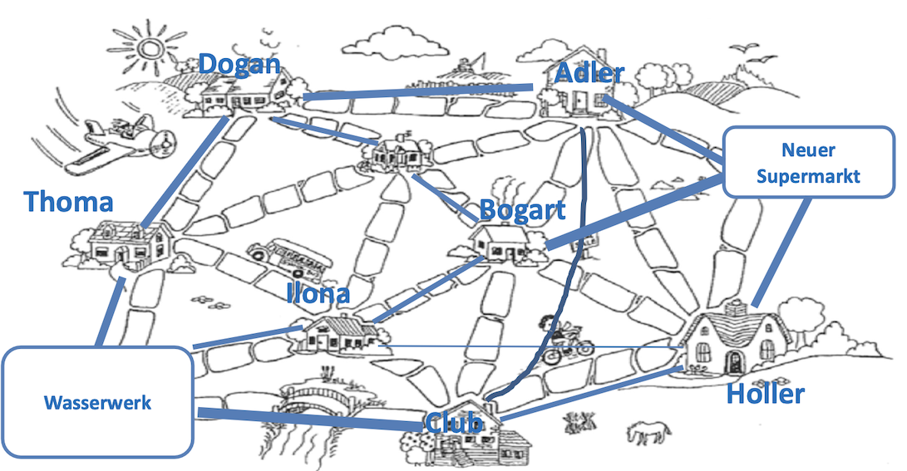

# Problem 2 - "Wasserversorgung"

Der Straßenbau in der Graphschaft Schilda war erfolgreich, die Stadt blüht und gedeiht wieder! Selbst ein neuer Supermarkt soll eröffnet werden. Nun muss dieser aber mit Wasser versorgt werden, und da Sie bereits das Straßenbauprojekt so erfolgreich durchgeführt haben, werden Sie nun auch damit beauftragt, den neuen Supermarkt an die Wasserversorgung anzuschließen.

Da die Stadt nach wie vor kein Geld verschwenden möchte, müssen Sie zunächst feststellen, ob das bestehende Leitungsnetz noch ausreichend Kapazität für den zusätzlichen Wasserverbrauch hat, oder ob neue Leitungen benötigt werden. Da die Graphschaft Schilda noch keine Pumpen kennt, kann das Wasser nur bergab fließen. Als Vorarbeit haben Ihnen die Bürger die bestehende Wasserversorgung und die Lage des neuen Supermarktes aufgezeichnet:

## Modellierung des Problems

Das Problem lässt sich als Graphenmodell mit gerichteten und gewichteten Kanten darstellen. Jedes Haus ist ein Knoten, die Wasserleitungen zwischen den Häusern sind die Kanten. Das Gewicht der Kanten wird durch den maximal möglichen Volumenstrom in m^3/s dargestellt.

Es wird nach dem maximalen Fluss im gegebenen Flussnetzwerk von einer Quelle zu einer Senke gesucht.

Durch die Kombination der Kanten von einer Quelle (Startpunkt) zu einer Senke (Endpunkt) erhält man mögliche Flusspfade. Wenn ein Pfad gefunden wurde, wird das maximal mögliche Kantengewicht (Gewicht der kleinsten Kante) von allen Kanten aus dem Pfad abgezogen. Dieser Vorgang wird so lange wiederholt, bis es keinen möglichen Flusspfad mit freier Kapazität von der Quelle zur Senke mehr gibt. Die einzelnen möglichen Flusspfade werden zu einem Gesamtdurchfluss addiert. Durch Verwenden des Edmonds-Karp-Algorithmus wird stehts der kürzeste Weg mit freien Kapazitäten gewählt und somit auch das schnellstmögliche Abarbeiten des Graphen gewährleistet.

Um den Graph zu modellieren werden die Java-Bibliotheken `JGraphT` und `JGraphX` verwendet. Mit `JGraphT` wird der Graph als Datenstruktur modelliert. Mit `JGraphX` wird der Graph als Grafik dargestellt und auf dem Bildschirm dargestellt.

## Die Eingabe

Die Eingabe besteht aus einem Graphen, der aus Kanten und Knoten besteht. Diese werden aus einer `.txt` Datei gelesen und in eine Instanz der Klasse `AdjazenzMatrix.java` geladen. Diese Instanz dient als Basis für die Berechnung des maximalen Flusses von Quelle zu Senke.

Für die Matrix in der Datei `problem2.txt` wurden jeweils die Anfangsbuchstaben W, A, B, C, D, H, I, T, S, der Gebäude aus dem Bild als Bezeichnung genutzt. Wobei W für das Wasserwerk als Quelle steht und S für den Supermarkt als Senke.



```js
// code/data/problem2.txt
  W A B C D H I T S
W 0 0 0 12 0 0 6 15 0
A 0 0 0 0 0 0 0 0 10
B 0 0 0 0 0 0 0 0 10
C 0 5 0 0 0 5 0 0 0
D 0 5 6 0 0 0 0 0 0
H 0 0 0 0 0 0 0 0 7
I 0 0 3 0 0 1 0 0 0
T 0 0 0 0 8 0 0 0 0
S 0 0 0 0 0 0 0 0 0 
```

## Die Ausgabe

Die Ausgabe wird als Graph in einem Fenster dargestellt und in die Datei `2 Wasserversorgungsplaner.txt` geschrieben. Die erzeugte Datei wird im Projekt im Ordner `output` abgelegt und kann mit einem Text Editor geöffnet werden.
Das Fenster zur Visualisierung der Graphen besteht aus zwei Hälften. Auf der linken Seite wird der Eingabegraph dargestellt. Auf der rechten Seite wird der berechnete Ausgabegraph dargestellt. In diesem Graph entsprechen die Werte der Kanten dem maximal nutzbaren Volumenstrom pro Kante von Wasserwerk zu Supermarkt.

Eine korrekte Ausgabe erfüllt folgende Eigenschaften:

- Der Fluss von Quelle zu Senke muss maximal sein

- Alle nutzbaren Pfade für Flüsse müssen gefunden werden

- Der maximal mögliche Fluss pro Pfad muss von den Pfadkanten abgezogen werden

- Die Kanten müssen gerichtet sein und der Rückfluss aus dem Ausgabegraph entfernt

- Es muss ersichtlich sein welcher Volumenstrom an der Quelle möglich ist


```js
// code/data/2 Wasserversorgungsplaner.txt
  W A B C D H I T S 
W 0 0 0 10 0 0 4 8 0 
A 0 0 0 0 0 0 0 0 10 
B 0 0 0 0 0 0 0 0 6 
C 0 5 0 0 0 5 0 0 0 
D 0 5 3 0 0 0 0 0 0 
H 0 0 0 0 0 0 0 0 6 
I 0 0 3 0 0 1 0 0 0 
T 0 0 0 0 8 0 0 0 0 
S 0 0 0 0 0 0 0 0 0 
```

## Geeignete Algorithmen

Es gibt verschiedene Algorithmen, die verwendet werden können, um den maximalen Fluss in einem gerichteten Graph zu berechnen. Einige dieser Algorithmen sind:

**Ford-Fulkerson-Algorithmus**: Dieser Algorithmus ist ein iterativer Algorithmus, der in jedem Schritt den Fluss durch einen Pfad erhöht, der vom Quellknoten zum Zielknoten führt und dessen Kapazität noch nicht vollständig ausgeschöpft ist. Der Algorithmus endet, wenn kein solcher Pfad mehr existiert.

**Dinic-Algorithmus**: Dieser Algorithmus ist ebenfalls ein iterativer Algorithmus, der den Fluss durch den Graph in jedem Schritt erhöht, indem er einen Pfad vom Quellknoten zum Zielknoten sucht, dessen Kapazität noch nicht vollständig ausgeschöpft ist. Im Gegensatz zum Ford-Fulkerson-Algorithmus verwendet der Dinic-Algorithmus jedoch eine Heuristik, um schneller zum Ergebnis zu gelangen.

**Edmonds-Karp-Algorithmus**: Dieser Algorithmus ist eine Variation des Ford-Fulkerson-Algorithmus und verwendet auch eine Heuristik, um schneller zum Ergebnis zu gelangen. Im Gegensatz zum Dinic-Algorithmus verwendet der Edmonds-Karp-Algorithmus jedoch eine Breitensuche statt einer Tiefensuche, um Pfade im Graph zu finden.

**Preflow-Push-Algorithmus**: Dieser Algorithmus ist ein schneller, parallelisierbarer Algorithmus, der den Fluss durch den Graph in jedem Schritt erhöht, indem er einen Pfad vom Quellknoten zum Zielknoten sucht, dessen Kapazität noch nicht vollständig ausgeschöpft ist. Im Gegensatz zu den anderen Algorithmen, die hier aufgeführt sind, ist der Preflow-Push-Algorithmus jedoch nicht iterativ, sondern arbeitet in einem einzelnen Durchgang.

## Die Laufzeit des Algorithmus

Die Laufzeit der Funktion `bfs()` ist O(V + E). In jedem Schritt wird ein Knoten aus der Warteschlange entfernt und die Nachbarknoten des Knotens werden in die Warteschlange aufgenommen. Da jeder Knoten nur einmal in die Warteschlange aufgenommen wird und jede Kante nur einmal betrachtet wird, beträgt die Laufzeit O(V + E).

Die Laufzeit des Ford-Fulkerson-Algorithmus ist O(V * E^2). Der Algorithmus wird in jedem Schritt iterativ ausgeführt, bis kein Pfad mehr vom Quellknoten zum Zielknoten verfügbar ist, der dessen Kapazität noch nicht vollständig ausgeschöpft hat. In jedem Schritt wird eine Breitensuche ausgeführt, um einen solchen Pfad zu finden.

Da am Ende der `fordFulkerson(int[][] matrix)` Funktion noch eine Ausgabematrix erzeugt wird erhöht sich die Laufzeit um O(V^2). Mit der gleichen Laufzeit werden zusätzlich noch die inversen Kanten des Graphen entfernt.

```java
// Filtere die inversen Kanten
for (int i = 0; i < matrix_output.length; i++)
  for (int j = 0; j < matrix_output[i].length; j++)
    if (matrix_output[i][j] < 0)
      matrix_output[i][j] = 0;
```

Daraus folgt eine Laufzeit von O(V * E^2 + V^2).

## Die Implementierung des Algorithmus

Zur Lösung des Problems wurde der Ford-Fulkerson-Algorithmus verwendet. Genauer gesagt wurde der Edmonds-Karp-Algorithmus verwendet, da dieser eine Breitensuche verwendet, um Pfade im Graph zu finden.  

Zuerst wird die Matrix `matrix` in eine echte Kopie `output` kopiert. Die echte Kopie wird später als Ausgabe verwendet.

Danach wird ein Eltern-Array `parent` erstellt, das die Elternknoten der Knoten im Graph speichert. Dieses Array wird später verwendet, um den Pfad vom Quellknoten zum Zielknoten zu finden.

Als nächstes wird eine Breitensuche ausgeführt, um einen Pfad vom Quellknoten zum Zielknoten zu finden, dessen Kapazität noch nicht vollständig ausgeschöpft ist. Die Breitensuche wird durch die Funktion `bfs()` ausgeführt. Die Funktion `bfs()` gibt `true` zurück, wenn ein Pfad gefunden wurde, der vom Quellknoten zum Zielknoten führt und dessen Kapazität noch nicht vollständig ausgeschöpft ist. Andernfalls wird `false` zurückgegeben.

Als Datenstruktur der `bfs()` Funktion wird eine LinkedList verwendet. Die Laufzeit der `poll()` Funktion beträgt O(1), da die LinkedList eine doppelt verkettete Liste ist. Die Laufzeit der `add()` Funktion beträgt ebenfalls O(1), da die LinkedList eine doppelt verkettete Liste ist.

Wenn ein solcher Pfad gefunden wurde, wird der minimale Fluss des Pfades berechnet. Der minimale Fluss des Pfades ist die kleinste Kapazität, die noch nicht vollständig ausgeschöpft ist. Dieser Wert wird dann zum maximalen Fluss des Graphen addiert. 

Zuletzt wird eine neue Ausgabematrix erstellt, die nur aus dem positiven Fluss des Graphen besteht. 


```java
/**
 * Laufzeit: O(V * E^2 + V^2)
 * 
 * @param matrix
 * @return
 */
private int[][] fordFulkerson(int[][] matrix) {

  // Anzahl der Knoten im Graph
  int nodes = matrix[0].length;
  // Die Quelle is der erste Knoten
  int source = 0;
  // Die Senke ist der letzte Knoten
  int sink = nodes - 1;
  // Flow ist zu Beginn 0
  max_flow = 0;

  int u, v;

  // Erzeuge echte Kopie der Matrix für Output
  int output[][] = new int[nodes][nodes];
  for (u = 0; u < nodes; u++)
    for (v = 0; v < nodes; v++)
      output[u][v] = matrix[u][v];

  // Erzeuge ein Eltern Array zum speichern der möglichen BFS-Pfade
  int parent[] = new int[nodes];

  // Wenn für einen Pfad der BFS möglich ist, überprüfe seinen maximalen Fluss
  while (bfs(matrix, output, source, sink, parent)) {

    // Setze den Pfad Fluss auf unendlich
    int path_flow = Integer.MAX_VALUE;
    // Finde den maximalen Fluss durch die möglichen Pfade
    for (u = sink; u != source; u = parent[u]) {
      v = parent[u];
      path_flow = Math.min(path_flow, output[v][u]);
    }

    // aktualisiere die Kanten aus dem Eltern Array
    for (u = sink; u != source; u = parent[u]) {
      v = parent[u];
      // Ziehe den Fluss-Pfad den Kanten ab
      output[v][u] -= path_flow;
      // Addiere den Fluss-Pfad auf die Inversen Kanten
      output[u][v] += path_flow;
    }

    // Addiere die einzelnen Flusspfade auf den maximalen Fluss
    max_flow += path_flow;
  }

  // Ziehe von der Eingabe Matrix die übrigen Flussgewichte ab
  int[][] outputGraph = new int[nodes][nodes];
  for (int i = 0; i < matrix[0].length; i++)
    for (int j = 0; j < matrix[0].length; j++)
      outputGraph[i][j] = matrix[i][j] - output[i][j];

  return outputGraph;
}

/**
 * Laufzeit: O(V + E)
 * 
 * @param matrix
 * @param output
 * @param s
 * @param t
 * @param parent
 * @return
 */
private boolean bfs(int[][] matrix, int output[][], int s, int t, int parent[]) {

  // Anzahl der Knoten im Graph
  int nodes = matrix[0].length;

  // Array das alle Knoten als nicht besucht markiert
  boolean visited[] = new boolean[nodes];
  for (int i = 0; i < nodes; ++i)
    visited[i] = false;

  // Warteschlange, die besuchte Knoten als true markiert
  LinkedList<Integer> queue = new LinkedList<Integer>();
  queue.add(s);
  visited[s] = true;
  parent[s] = -1;

  // Standard BFS-Loop, entfernt Knoten aus der Warteschlange die ungleich 0 sind
  while (queue.size() != 0) {
    int u = queue.poll();

    for (int v = 0; v < nodes; v++) {
      if (visited[v] == false && output[u][v] > 0) {
        // Wenn wir einen möglichen Pfad von s nach t finden geben wir true zurück
        if (v == t) {
          parent[v] = u;
          return true;
        }
        // Wenn wir keinen möglichen Pfad finden fügen wir den Knoten zur Warteschlange
        // und markieren ihn als besichtigt
        queue.add(v);
        parent[v] = u;
        visited[v] = true;
      }
    }
  }
  return false;
}
```