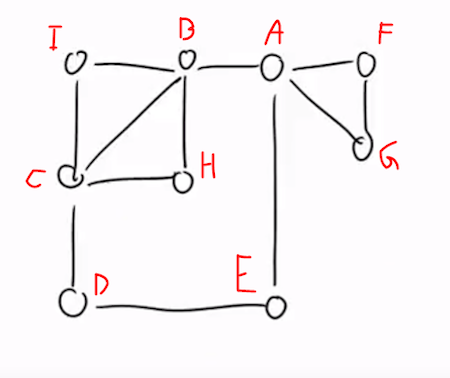

# Problem 5 - "Die Festhochzeit - das Verteilen der Einladungen"

Zum großen Hochzeitfest in Schilda sollen natürlich alle Ortsbewohner eingeladen werden.

Da in der letzten Zeit in Schilda viele neue Straßen gebaut worden waren, muss der Briefträger eine neue Route finden. Glücklicherweise haben alle Häuser ihre Briefkästen an die neuen Straßen gestellt, so dass der Briefträger nur noch den kürzesten Weg finden muss, der ausgehend von der Post durch alle Straßen und dann wieder zurück zur Post führt.

Hier sind Sie wieder gefragt:
Unterstützen Sie den Briefträger und entwerfen Sie die neue Route für den Briefträger. Den Stadtplan kennen Sie ja bereits, schließlich haben Sie die Straßen gebaut.

## Modellierung des Problems

Das Problem lässt sich Graphenmodell mit ungerichteten und ungewichteten Kanten darstellen. Für die Eingabe wurde ein eigener Graph erstellt, die Kreise symbolisieren die Knoten und die Verbindungen dazwischen die Kanten. (Der Graph muss ein Eulerkreis sein, das bedeutet er darf nur Knoten mit gerader Kantenanzahl besitzen. => nochmal nachlesen)

Es wird nach einem Weg auf dem Graphen gesucht, der jede Kante nur einmal abläuft und bei dem der Startknoten gleich dem Endknoten ist.

Um den Ausgabegraph zu modellieren, wird an einem beliebigen Startknoten angefangen und von diesem aus alle Knoten abgelaufen bis ein bereits bekannter Knoten wieder getroffen wird, der keine freien Nachbarn mehr besitzt. Wenn es noch freie Knoten gibt, geht man den Weg wieder zurück, bis man einen Knoten erreicht der noch freie Nachbarn besitzt. Dieser Vorgang wird wiederholt, bis es keinen Knoten mit unbesuchten Nachbarn mehr gibt.

Um den Graph zu modellieren werden die Java-Bibliotheken `JGraphT` und `JGraphX` verwendet. Mit `JGraphT` wird der Graph als Datenstruktur modelliert. Mit `JGraphX` wird der Graph als Grafik dargestellt und auf dem Bildschirm dargestellt.

## Die Eingabe

Die Eingabe besteht aus einem Graphen, der aus Kanten und Knoten besteht. Diese werden aus einer `.txt` Datei gelesen und in eine Instanz der Klasse `AdjazenzMatrix.java` geladen. Diese Instanz dient als Basis für die Berechnung einer geschlossenen Eulertour.

Das Bild wurde passend zur Aufgabenstellung selbst gezeichnet und mit den Buchstaben von A bis I beschriftet und daraus wurde die Datei `problem5.txt` erstellt.



```js
// code/data/problem5.txt
  A B C D E F G H I
A 0
B 1 0
C 0 1 0
D 0 0 1 0
E 1 0 0 1 0
F 1 0 0 0 0 0
G 1 0 0 0 0 1 0
H 0 1 1 0 0 0 0 0
I 0 1 1 0 0 0 0 0 0
```

## Die Ausgabe

Die Ausgabe wird (als Graph) Reihenfolge von Knoten in einem Fenster dargestellt und in die Datei `5 Festhochzeitsplaner` geschrieben. Das Fenster besteht aus zwei Hälften. Auf der linken Seite wird der Eingabegraph dargestellt. Auf der rechten Seite wird der berechnete (Graph) Weg dargestellt.

Eine korrekte Ausgabe erfüllt folgende Eigenschaften:

- Alle Kanten müssen genau einmal enthalten sein

- Der Endknoten muss gleich dem Startknoten sein

- Der Graph muss zusammenhängend sein

- Bei der Ausgabe Reihenfolge müssen die folgenden Knoten immer Nachbarknoten des vorherigen sein

- Alle Knoten des Eingabe-Graphen müssen im Ausgabe-Graphen enthalten sein.


```js
// code/output/5 Festhochzeitsplaner.txt
[A, B, C, H, B, I, C, D, E, A, F, G, A]
```

## Geeignete Algorithmen

Es gibt verschiedene Algorithmen, die verwendet werden können, um eine geschlossenen Eulertour eines ungerichteten und ungewichteten Graphen zu berechnen. Einige dieser Algorithmen sind:

### Algorithmus von Hierholzer

Dieser Algorithmus basiert auf der Tatsache, dass in einem ungerichteten und unbelichteten Graphen mit genau einer geraden Anzahl von Knoten mit ungerader Gradanzahl eine geschlossene Eulertour existiert. Der Algorithmus startet an einem beliebigen Knoten mit ungerader Gradanzahl und folgt dann den Kanten, bis er wieder zum Ausgangsknoten zurückkehrt. Dieser Prozess wird wiederholt, bis alle Kanten besucht wurden.

### Algorithmus von Fleury

Dieser Algorithmus startet ebenfalls an einem beliebigen Knoten mit ungerader Gradanzahl und wählt dann immer eine Kante aus, die den aktuellen Knoten mit einem anderen Knoten verbindet. Wenn es mehrere mögliche Kanten gibt, wird die Kante gewählt, die nicht zu einem Knoten führt, der bereits besucht wurde. Der Algorithmus endet, wenn alle Kanten besucht wurden und man wieder am Ausgangsknoten angekommen ist.

### Schreier-Sims-Algorithmus

Dieser Algorithmus erstellt zunächst eine Spur (engl. trace) des Graphen, indem er eine beliebige Kante wählt und diese nach und nach verfolgt, bis er wieder am Ausgangspunkt ankommt. Dann sucht er eine weitere Kante, die nicht Teil der Spur ist und fügt sie in die Spur ein, bis er wieder am Ausgangspunkt ankommt. Dieser Prozess wiederholt sich, bis alle Kanten in die Spur eingefügt wurden.

## Die Laufzeit des Algorithmus

Laufzeit Problem 5 = O(V^2)

Die Laufzeit der Funktion `hierholzerEulerTour()` hängt von der Anzahl der Knoten (V) im Graph ab. Die Laufzeit der Schleife, die die Nachbarn eines Knotens durchläuft, beträgt O(V^2), da jeder Knoten mit jedem anderen Knoten verglichen werden Kann. Die Laufzeit des Stacks beträgt normal O(1). Daraus ergibt sich eine Laufzeit von O(V^2)

Die Funktion `mirrorMatrix()` hat eine Laufzeit von O(V^2), da zwei for-Schleifen verschachtelt sind, die jeweils eine Laufzeit von O(V) beistzen.

Die while-Schleife hat eine Laufzeit von O(V), da alle Knoten in der Prioritätswarteschlange einmal durchlaufen werden können. Innerhalb der while-Schleife wird ein Element aus der Warteschlange genommen O(log(V)) und die Funktion `getNeighbors()` aufgerufen.

Daraus resultiert eine Laufzeit von O(V^2) + O(V^2).
Umgeformt ergibt sich eine Laufzeit von 2 * O(V^2).

## Die Implementierung des Algorithmus

asdf

```java
 private ArrayList<Character> hierholzerEulerTour(int[][] matrix, char[] vertexLetters) {
    // ArrayList, um den Pfad zu speichern
    ArrayList<Character> path = new ArrayList<>();
    // Stack, um die nächsten Knoten zu speichern
    Stack<Character> stack = new Stack<>();

    // Erster Knoten als Startpunkt
    char start = vertexLetters[0];
    stack.push(start);

    // Solange der Stack nicht leer ist
    while (!stack.isEmpty()) {
      // Hole aktuellen Knoten aus dem stack
      char current = stack.peek();

      // Gehe alle Nachbarn durch
      boolean foundNext = false;
      for (int i = 0; i < matrix.length; i++) {
        // Index des aktuellen Knotens
        int index = current - vertexLetters[0];

        // Wenn der Knoten keinen Nachbarn hat, überspringe ihn
        if (matrix[index][i] != 1)
          continue;

        // füge den Nachbarn dem Pfad/Stack hinzu
        stack.push(vertexLetters[i]);

        // Entferne die Kante zwischen dem aktuellen und nächsten Knoten
        matrix[index][i] = 0;
        matrix[i][index] = 0;
        foundNext = true;
        break;
      }
      // Wenn kein weiterer Nachbar gefunden wurde, entferne den aktuellen Knoten vom
      // Stack und füge ihn dem Pfad hinzu
      if (!foundNext)
        path.add(0, stack.pop());
    }
    return path;
  }
  private int[][] mirrorMatrix(int[][] matrix) {
    int[][] mirrored = new int[matrix.length][matrix.length];
    for (int i = 0; i < matrix.length; i++)
      for (int j = 0; j < matrix.length; j++)
        if (i < j)
          mirrored[i][j] = matrix[j][i];
        else
          mirrored[i][j] = matrix[i][j];
    return mirrored;
  }
```
