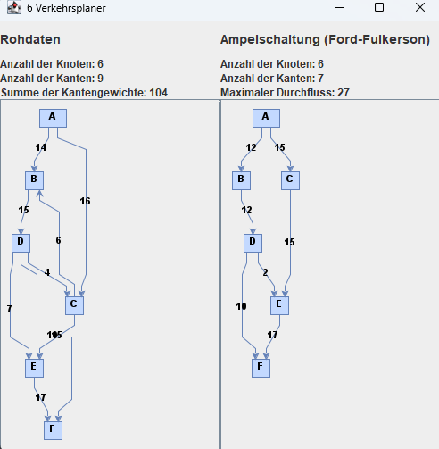

# Problem 6 - "Wohin nur mit den Gästen?"

Zum Einweihungsfest werden zahlreiche auswärtige Gäste eingeladen. Reisen diese allerdings
alle mit dem Auto an, dann ist ohne hervorragende Verkehrsplanung ein Stau in der Innenstadt
vorprogrammiert. Parken können die Autos auf dem Parkplatz des neuen Supermarktes. 

Doch wie soll der Verkehr durch die Stadt geleitet werden, dass möglichst viele Fahrzeuge von der
Autobahn zum Parkplatz gelangen können, ohne dass sich lange Schlangen vor den Ampeln
bilden? Die Kapazität der einzelnen Straßen haben Ihnen die Bürger der Stadt bereits
aufgezeichnet. 

Sie sollen nun planen, wie viele Wagen über die einzelnen Wege geleitet werden
sollen.

## Modellierung des Problems

## Die Eingabe

## Die Ausgabe

## Der Alrogithmus

## Die Laufzeit des Algorithmus

## Die Implementierung des Algorithmus